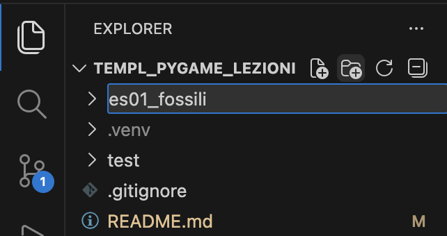
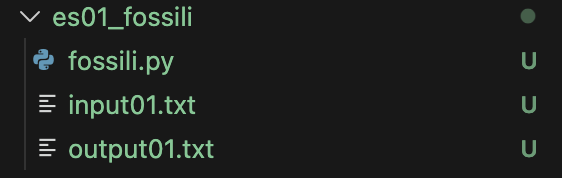

# Sezione Olimpiadi di Informatica

## Preparazione ambiente per il singolo problema
Prepariamo ad esempio l'ambiente per risolvere il problema "Fossili"
### Apriamo la pagina del problema
- Login su [training.olinfo.it](https://training.olinfo.it)
- Click su: Risolvi i problemi / Territoriali
- Cercare "fossili" / Click "Antichi fossili"

**Prima ancora di leggere e comprendere il problema**, prepariamo l'ambiente di sviluppo.
### Prepariamo l'ambiente
- Creare la cartella "es01_fossili", che conterrà tutti i file relativi al problema.


- Dalla pagina del problema "Antichi fossili", scaricare il template python "fossili.py" nella cartella "es01_fossili" appena creata
- Aprire fossili.py
- Attivare le righe relative a sys.stdin e sys.stdout (eliminare il commento '#')
- Modificare "input.txt" --> "input01.txt"
- Aggiungere le seguenti righe di codice necessarie a leggere correttamente gli input dalla cartella "es01_fossili":
```python
import os
from pathlib import Path
os.chdir(Path(__file__).parent)
```
Il template modificato dovrebbe apparire quindi:
```python
import sys
import os
from pathlib import Path
os.chdir(Path(__file__).parent)
# se preferisci leggere e scrivere da file
# ti basta decommentare le seguenti due righe:
sys.stdin = open('input01.txt')
sys.stdout = open('output.txt', 'w')
...
```
- Creare nella cartella "es01_fossili" due file vuoti: input01.txt, output01.txt


- Copiare la sezione **Input** del problema nel file input01.txt
- Copiare la sezione **Output** del problema nel file output01.txt
- Quindi il file input01.txt conterrà:
```text
2

15 43
20 500
7 30

70 100
70 100
70 100
```
ed il file output01.txt conterrà:
```text
Case #1: 10
Case #2: 30
```
In definitiva, per come abbiamo impostato il template, gli input saranno letti dal file **input01.txt** ed i risultati saranno scritti nel file **output.txt**.

Per meglio comprendere il funzionamento del template, consiglio di lanciare il debugger (breakpoint sulla prima istruzione, click su fossili.py / opzioni tasto run ▶️ / debug) ed eseguire il template una istruzione per volta.

A questo punto siamo pronti per risolvere il problema. Quello che resta da fare è analizzare l'esercizio e scrivere il proprio programma sostituendo **solo queste righe** presenti nel template
```python
# aggiungi codice...
risposta = 42
```
- Eseguire il programma: click su fossili.py / tasto run ▶️ in alto a destra.

Solo quando il programma che scriveremo genererà un file **output.txt** identico al file **output01.txt**, con buone probabilità la nostra soluzione risulterà corretta e saremo quindi pronti per caricare la soluzione su training.olinfo.it!


- Per salvare il lavoro, click su Source Control / Message + Commit & Push

- Al termire, effettuare il Logout da Visual Studio Code / GitHub

### Accedere ad altri esercizi
- Login su [training.olinfo.it](https://training.olinfo.it)
- Click su: Risolvi i problemi
  - Nazionali, OIS: qui i problemi sono raggruppati per difficoltà
  - Territoriali
- Click su: Algobadge, apprendimento guidato
- Wiki, Forum: soluzioni e supporto ad alcuni problemi in piattaforma

<hr/>

# Sezione Pygame

## Installazione librerie
- Aprire il terminale
- Eseguire:
```bash
pip install pygame pymunk
```

## Eseguire il test
- Selezionare test/test_pymunk.py
- Premere il tasto run ▶️ in alto a destra
- Dei Click nella finestra generano delle sfere soggette alla forza di gravità
